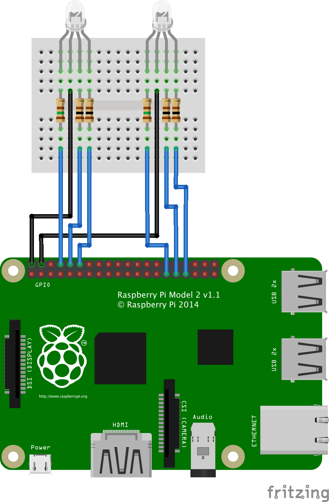

# AQ Sensor Raspberry Pi LEDs
Raspberry Pi project that shows the health levels of PM2.5 and PM10 sensor readings from a [Luftdaten](https://luftdaten.info) air quality sensor.

This project was developed to make use of sensors setup as part of the [Air Quality Aberdeen](https://www.airaberdeen.org) project.

When running the first LED will indicate the PM10 level over a range of 0 to 20 with the LED going from green to red depending on the value.

The second LED will indicate the PM2.5 level over a range of 0 to 10 with LED going from green to red depending on the value.

If the Raspberry Pi is unable to connect to the Luftdaten API then the second LED will go blue.

When it starts up, just as a diagnostics test, the first LED will cycle from green to red.

## Hardware requirements
Raspberry Pi (initial build was done using a 2 B+ but it should work on other models)

* 2 x RGB LED anode
* 2 x 100 ohm resistors
* 4 x 150 ohm resistors
* Breadboard
* 6 x female - male jumper wires



## Configuring

Change the following in the code:

* `SENSOR_ID` to the Luftdaten ID of the sensor you wish to monitor.
* `UPDATE_FREQUENCY` to the number of milliseconds between requests to the Luftdaten API.

## Running

```
sudo python3 aqsensor.py
```
